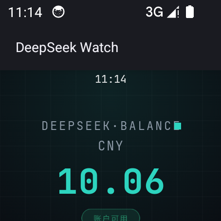

# ⌚ DeepSeek Watch

> 一块手表，随时掌握你的 DeepSeek API 余额。

**DeepSeek Watch** 是一款面向三星 Galaxy Watch（Wear OS 3+）的原生余额监控应用。抬手即可看到 DeepSeek API 账户余额、消耗趋势与可用状态，支持表盘"复杂"直接挂载余额小部件。

本项目的全部代码由 **DeepSeek V4 Flash** 设计并实现——从架构选型、UI 设计到真机调试，全程由 AI 独立完成，人只负责提出需求与验收。

---

## ✨ 功能一览

| 功能 | 说明 |
|---|---|
| 💰 **实时余额** | 直连 DeepSeek 官方 API，大号等宽数字展示，自动刷新（30 秒 / 1 分钟 / 5 分钟可选） |
| 📱 **扫码导入 Key** | 手表生成二维码（随机端口 + 一次性 token），手机扫码后在网页粘贴 API Key，一键导入 |
| 🖥️ **表盘"复杂"小部件** | 在表盘上直接添加「DeepSeek 余额」，不用打开 App 就能看到余额，点击直达应用 |
| 🌀 **表冠 / 数字表圈滚动** | 支持旋转表冠与触摸表圈滚动列表，手感跟手（含三星 detent 触感） |
| 📈 **历史趋势** | 本地采样余额快照，绘制带 XY 数值标注的趋势曲线，估算消耗速率（元/小时） |
| ⚠️ **低余额提醒** | 可配置阈值（默认 ¥5），余额跌破时马达振动提醒 |
| 🔑 **多 Key 管理** | 保存 / 切换 / 删除多个 API Key，快速切换当前使用的账户 |

## 📸 截图

| 主页（成功态） | 历史趋势 | 设置 |
|:---:|:---:|:---:|
|  | 待补充 | 待补充 |

## 🛠 技术栈

- **语言 / UI**：Kotlin · Jetpack Compose for Wear OS（Material 1.3.1）
- **网络**：OkHttp + kotlinx-serialization（直连 `api.deepseek.com/user/balance`）
- **持久化**：DataStore Preferences（Key 列表 / 余额历史 / 设置项）
- **扫码导入**：NanoHTTPD 嵌入式服务器（随机端口 + 一次性 token）+ ZXing 二维码
- **字体**：JetBrains Mono（SIL OFL，随包分发）
- **调试**：内置 debug intent（`debug_seed_history` / `debug_fake_success`）便于模拟器验证

## ⚠️ 已知限制

诚实说明——这个应用并不是完美的：

- **用量统计是估算值**：DeepSeek 官方没有开放"用量查询" API，历史趋势只能通过应用运行期间的余额快照推算消耗，不代表官方统计口径。
- **采样依赖应用活跃**：只有 App 在前台（或进程存活）时才会记录余额快照；长时间不打开，趋势曲线会有空洞。
- **Complication 更新周期约 30 分钟**：表盘小部件由系统按周期调度，不是秒级刷新。
- **低余额提醒仅振动**：没有通知横幅，因为 Wear OS 的通知需要额外权限与用户授权，第一版从简。
- **自动刷新耗电**：1 分钟间隔在后台持续轮询会消耗手表电量，建议日常使用 5 分钟档位。
- **API Key 明文存储**：Key 保存在应用私有 DataStore 中（仅本应用可读），未做加密。建议使用专用监控 Key，而非主账户 Key。
- **未经应用商店审核**：目前以侧载（adb 安装）方式分发，未上架 Galaxy Store / Play Store。

## 🏗 构建

```bash
# 环境要求：JDK 17、Android SDK（platform 35）
git clone https://github.com/Honokanya/DeepSeekWatch.git
cd DeepSeekWatch
./gradlew :app:assembleDebug
# 产物：app/build/outputs/apk/debug/app-debug.apk
```

真机安装（无线调试）：

```bash
adb pair <手表IP>:<配对端口>          # 输入手表上显示的配对码
adb connect <手表IP>:<调试端口>
adb install -r app/build/outputs/apk/debug/app-debug.apk
```

首次使用：设置 → 扫码导入 Key → 手机扫码粘贴 API Key。

## 🧪 测试

```bash
./gradlew :app:testDebugUnitTest
```

单元测试覆盖：余额 API 解析、401 错误处理、网络异常路径（MockWebServer）。

## 📄 许可

[MIT License](LICENSE) · 自由使用与修改，保留署名即可。

---

*Built with ❤️ and DeepSeek V4 Flash — 2026*
